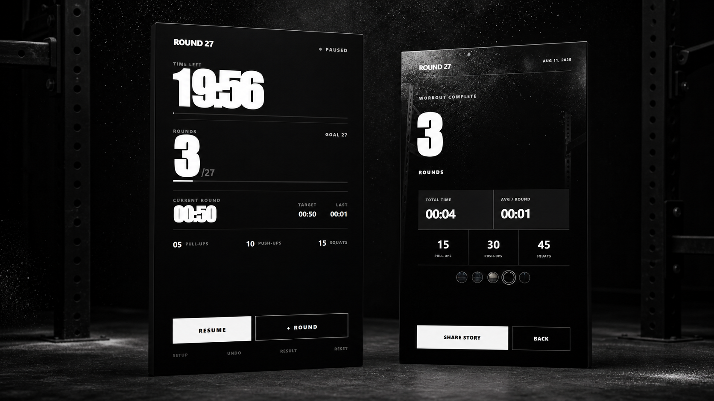

<div align="center">

# ROUND 27

**A focused Cindy / AMRAP pace timer built for the workout floor.**

[](https://github.com/Kkubuck/round-27/releases/latest)
[](https://github.com/Kkubuck/round-27/actions/workflows/windows.yml)
[](https://github.com/Kkubuck/round-27/releases)
[](#download)

[Download](https://github.com/Kkubuck/round-27/releases/latest) · [Features](#features) · [Build](#build-from-source) · [Security](SECURITY.md)

</div>



<p align="center"><sub>Live countdown · adaptive round target · round history · rep totals · 1080 × 1920 Story export</sub></p>

## Download

Open the [latest release](https://github.com/Kkubuck/round-27/releases/latest) and choose one of these x64 builds:

- `Round-27-Setup-<version>-x64.exe` — standard one-click installer.
- `Round-27-Portable-<version>-x64.exe` — no installation; download and run.

The current builds are not code-signed, so Microsoft Defender SmartScreen may show an **Unknown publisher** warning. Verify the file against `SHA256SUMS.txt` in the same release before running it.

## Features

- A clear 20-minute AMRAP clock with large, high-contrast numbers.
- Cindy defaults: 5 pull-ups, 10 push-ups, and 15 squats per round.
- Dynamic pacing: after each completed round, the remaining time is divided by the remaining goal rounds. Finish early and every later target adjusts automatically.
- Current-round timer, previous-round time, target pace, undo, pause, and reset.
- Five original workout backgrounds for the result card.
- A clean 1080 × 1920 PNG result card ready for an Instagram Story.
- Fullscreen mode, display sleep prevention, and native Save dialog.
- Fully offline: no account, ads, analytics, or cloud dependency.

## Use

1. Set the workout duration and target rounds. The default challenge is 20 minutes / 27 rounds.
2. Press **Start**.
3. Press **+ Round** every time a full round is complete.
4. Open **Result** when the workout ends, choose a background, and save the Story image.

### Keyboard shortcuts

| Key | Action |
| --- | --- |
| `Space` | Complete a round |
| `P` | Pause or resume |
| `F11` | Toggle fullscreen |

## Privacy

Round 27 runs locally and does not transmit workout data. It has no login, telemetry, advertising SDK, or remote API. Preferences stay on the device, and a result image is written only after the user chooses a save location.

## Build from source

Requirements: Windows 10/11 x64 and Node.js 22.13 or newer.

```powershell
npm ci
npm run desktop:dev
```

Run the complete desktop validation:

```powershell
npm run check:desktop
npm run lint
npm audit --omit=dev
```

Build the installer and portable executable:

```powershell
npm run desktop:package
```

Outputs are written to `release/installer/` and `release/portable/`. Generated executables, local deployment metadata, environment files, signing certificates, and credentials are excluded from Git.

## Release

Every push and pull request validates the desktop bundle. A tag such as `v1.0.0` builds both executables, generates `SHA256SUMS.txt`, and publishes a GitHub Release.

```powershell
git tag v1.0.0
git push origin v1.0.0
```

Signing certificates and passwords must be stored outside the repository. If signing is added later, use encrypted GitHub Actions secrets and a trusted code-signing service.

## Disclaimer

Round 27 is an independent training utility and is not affiliated with or endorsed by CrossFit, Inc. Exercise responsibly and scale movements to your ability.
